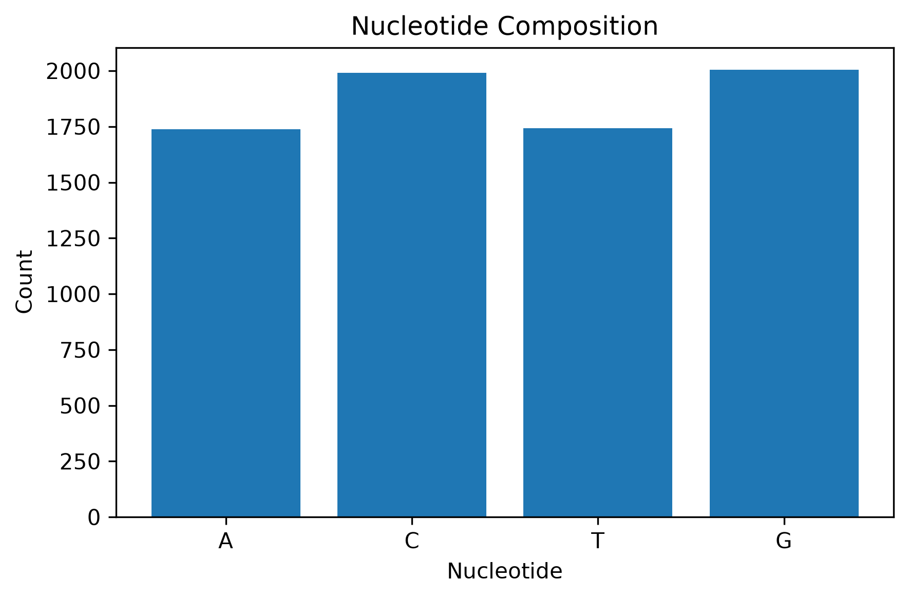
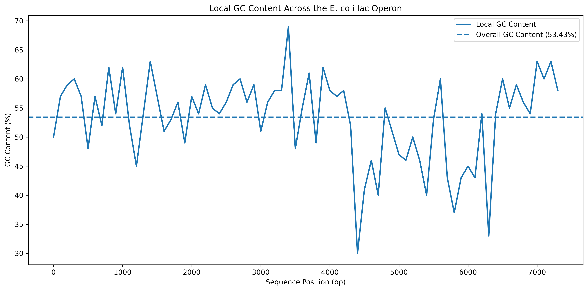

# DNA Sequence Analysis

A bioinformatics portfolio project using Python, Jupyter Notebook, Biopython, pandas, and matplotlib to analyze DNA sequence data.

## Project Overview

This project explores foundational bioinformatics workflows using both example DNA sequences and real biological sequence data from the *Escherichia coli* lactose operon.

The goal is to demonstrate how computational tools can be used to load, validate, analyze, transform, and visualize biological sequence data.

## Skills Demonstrated

* Python programming
* Jupyter Notebook workflows
* Biopython
* FASTA file parsing
* DNA sequence validation
* Nucleotide composition analysis
* GC and AT content analysis
* DNA complement and reverse-complement generation
* DNA-to-RNA transcription
* Codon parsing
* Protein translation
* pandas DataFrames
* matplotlib visualization
* Sliding-window GC analysis
* Git and GitHub version control

## Project Structure

```text
DNA_Sequence_Analysis/
│
├── data/
│   ├── raw/
│   └── processed/
│
├── notebooks/
│   └── dna_sequence_analysis.ipynb
│
├── results/
│   └── figures/
│
├── .gitignore
├── README.md
└── requirements.txt
```

## Analysis Workflow

The notebook currently includes:

1. DNA sequence validation
2. Sequence-length analysis
3. Nucleotide counting
4. GC and AT content calculations
5. DNA complement generation
6. Reverse-complement generation
7. DNA-to-RNA transcription
8. Biopython sequence verification
9. Codon parsing
10. Protein translation
11. FASTA file parsing
12. Real biological sequence analysis
13. Nucleotide composition visualization
14. Sliding-window GC content analysis

## Biological Sequence Data

The project analyzes sequence data from the *Escherichia coli* lactose operon.

NCBI accession used in the analysis:

**J01636.1**

The lactose operon contains genes involved in lactose metabolism and provides a manageable real-world sequence for learning bioinformatics workflows.

## Example Analyses
## Results

### Nucleotide Composition



### Sliding-Window GC Content




### Nucleotide Composition

The DNA sequence is analyzed to determine the counts and percentages of adenine, thymine, guanine, and cytosine.

### GC Content

Overall GC content is calculated to characterize sequence composition.

### Sliding-Window GC Analysis

Instead of calculating one GC percentage for the entire sequence, local GC content is calculated across smaller sequence windows. This allows changes in nucleotide composition to be examined across the sequence.

## Technologies

* Python
* Jupyter Notebook
* Biopython
* pandas
* matplotlib
* Git
* GitHub

## Future Development

Planned additions include:

* Motif searching
* Restriction enzyme recognition-site analysis
* Open reading frame detection
* Gene-region analysis
* Codon-frequency analysis
* Amino-acid composition
* Additional genomic visualizations

## Purpose

This project was created as a hands-on bioinformatics learning project and portfolio example demonstrating the integration of biological knowledge, programming, data analysis, and reproducible scientific workflows.
