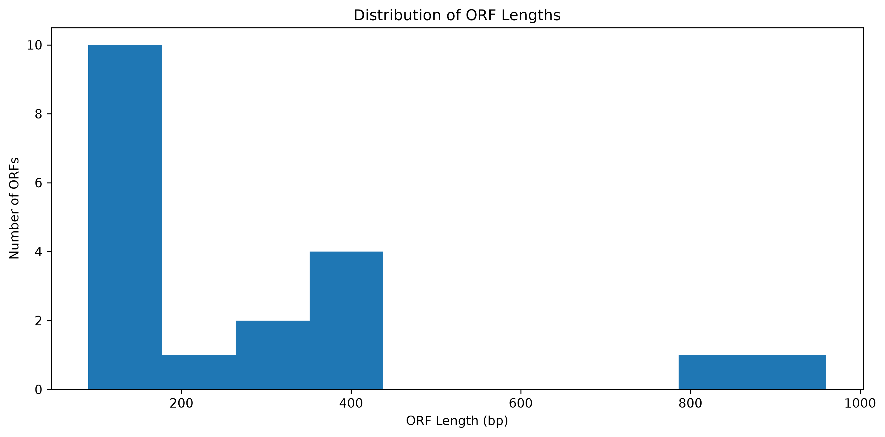

# 🧬 DNA Sequence Analysis

A bioinformatics portfolio project using Python, Biopython, pandas, and Matplotlib to analyze a real biological DNA sequence from the *Escherichia coli* lactose operon.

This project connects my background in biological sciences with programming and data analysis by demonstrating how computational tools can characterize DNA sequences, visualize nucleotide patterns, and identify candidate protein-coding regions.

## 🔎 Research Question

How can Python and Biopython be used to characterize the *E. coli* lactose-operon sequence and identify nucleotide-composition patterns, restriction sites, and candidate protein-coding regions?

## 🎯 Project Objectives

The objectives of this project were to:

* Validate DNA sequence data before analysis
* Calculate sequence length and nucleotide composition
* Measure overall and local GC content
* Generate DNA complements and reverse complements
* Demonstrate DNA-to-RNA transcription
* Translate DNA codons into amino acids
* Read biological sequence data from a FASTA file
* Search for DNA motifs and restriction-enzyme sites
* Identify candidate open reading frames
* Visualize important sequence characteristics
* Explain the biological meaning and limitations of the findings

## 🧫 Biological Background

DNA is composed of four nucleotide bases:

* **A** — Adenine
* **T** — Thymine
* **G** — Guanine
* **C** — Cytosine

The order of these bases stores biological information. Bioinformatics uses computational methods to analyze these sequences and identify characteristics such as base composition, motifs, coding regions, and possible translated proteins.

This project examines the *E. coli* lactose operon, which contains genes involved in lactose transport and metabolism.

## 📊 Dataset

The analyzed FASTA sequence was obtained from the National Center for Biotechnology Information.

* **Organism:** *Escherichia coli*
* **Sequence:** Lactose operon containing `lacI`, `lacZ`, `lacY`, and `lacA`
* **NCBI accession:** [J01636.1](https://www.ncbi.nlm.nih.gov/nuccore/J01636.1)
* **File:** `data/raw/sequence.fasta`

The original sequence is included for reproducibility and educational analysis.

## 🔬 Analysis Workflow

The notebook includes the following steps:

1. Validate DNA sequences
2. Calculate sequence length
3. Count adenine, thymine, guanine, and cytosine
4. Calculate GC and AT content
5. Generate complementary and reverse-complementary strands
6. Simulate DNA-to-RNA transcription
7. Verify manual calculations using Biopython
8. Divide DNA sequences into codons
9. Translate codons into amino-acid sequences
10. Parse a FASTA file using Biopython
11. Analyze the real *E. coli* lactose-operon sequence
12. Visualize nucleotide composition
13. Calculate sliding-window GC content
14. Search for DNA motifs
15. Search for restriction-enzyme recognition sites
16. Identify candidate open reading frames
17. Translate the longest candidate ORF
18. Visualize the distribution of ORF lengths

## 📈 Results

### Nucleotide Composition

The sequence contains slightly more guanine and cytosine than adenine and thymine.

The overall GC content was approximately **53.43%**.

GC content is useful because:

* GC-rich regions generally have greater thermal stability than AT-rich regions.
* GC content can influence PCR conditions and primer design.
* Local differences in GC content may reveal changes in sequence composition.
* GC-content analysis can help compare organisms and genomic regions.


### Sliding-Window GC Content

Overall GC content summarizes an entire sequence using a single percentage. However, nucleotide composition can vary across different sequence regions.

A sliding-window analysis was performed using non-overlapping 100-base-pair windows. This revealed local regions with GC content above or below the overall sequence average.


### Restriction-Enzyme Site Analysis

The sequence was searched for four common restriction-enzyme recognition motifs:

| Enzyme  | Recognition sequence | Sites identified |
| ------- | -------------------: | ---------------: |
| EcoRI   |               GAATTC |                1 |
| BamHI   |               GGATCC |                0 |
| HindIII |               AAGCTT |                0 |
| NotI    |             GCGGCCGC |                0 |

EcoRI was the only tested enzyme with a recognition site in the analyzed sequence.

### Candidate Open Reading Frames

A simplified ORF search was performed using forward reading frame 0.

The analysis:

* Searched for the `ATG` start codon
* Searched for the `TAA`, `TAG`, and `TGA` stop codons
* Required a minimum ORF length of 90 base pairs
* Detected **19 candidate ORFs**
* Identified a longest candidate ORF of **960 base pairs**
* Translated the longest candidate into an amino-acid sequence



These results represent candidate coding regions for learning purposes. They should not be interpreted as validated gene predictions.

## ⚠️ ORF Analysis Limitations

The current ORF analysis examines only **reading frame 0 on the forward DNA strand**.

A complete ORF search would evaluate:

* Three reading frames on the forward strand
* Three reading frames on the reverse-complement strand
* Six reading frames in total

The current method may miss valid coding regions in the other five frames. It may also identify ORFs that occur by chance and do not represent functional genes.

Additional annotation, sequence comparison, and biological validation would be required to identify genuine protein-coding regions.

Sequence positions produced directly by Python use zero-based indexing unless otherwise stated.

## 📁 Repository Structure

```text
DNA-Sequence-Analysis/
├── data/
│   └── raw/
│       └── sequence.fasta
├── notebooks/
│   └── dna_sequence_analysis.ipynb
├── results/
│   └── figures/
│       ├── nucleotide_composition.png
│       ├── orf_length_distribution.png
│       └── sliding_window_gc_content.png
├── .gitignore
├── README.md
└── requirements.txt
```

## 🛠️ Technologies and Skills

* Python
* Jupyter Notebook
* Biopython
* pandas
* Matplotlib
* FASTA file parsing
* DNA sequence validation
* Nucleotide composition analysis
* GC and AT content analysis
* Sliding-window analysis
* DNA transcription
* Protein translation
* Motif searching
* Restriction-site analysis
* Open reading frame detection
* Biological data visualization
* Git and GitHub

## ▶️ Running the Project

### 1. Clone the repository

```bash
git clone https://github.com/amberlin2/DNA-Sequence-Analysis.git
cd DNA-Sequence-Analysis
```

### 2. Create a virtual environment

```bash
python -m venv .venv
```

On Windows, activate it with:

```bash
.venv\Scripts\activate
```

On macOS or Linux, activate it with:

```bash
source .venv/bin/activate
```

### 3. Install the required packages

```bash
pip install -r requirements.txt
```

### 4. Open the notebook

```bash
jupyter notebook notebooks/dna_sequence_analysis.ipynb
```

Run the notebook from top to bottom to reproduce the analysis and visualizations.

## 🚀 Future Development

Potential extensions include:

* Expanding ORF detection to all six reading frames
* Comparing candidate ORFs with known gene annotations
* Performing BLAST-based sequence comparisons
* Calculating codon frequencies
* Analyzing amino-acid composition
* Performing sequence alignment
* Adding gene-region annotations
* Creating additional genomic visualizations
* Converting repeated code into reusable Python functions

## 💡 What I Learned

This project helped me understand how biological sequences can be represented and analyzed computationally.

I learned how to:

* Connect biological concepts with Python operations
* Validate sequence data before performing analysis
* Use Biopython to manipulate and translate DNA
* Parse real biological data from a FASTA file
* Examine both overall and local nucleotide composition
* Search for meaningful sequence patterns
* Identify candidate ORFs while recognizing the limitations of simplified gene-prediction methods
* Present biological results through tables, figures, and written interpretations

The project also reinforced the importance of distinguishing computational predictions from biologically validated conclusions.

## 👩‍🔬 About Me

I am an HTL(ASCP)-certified histotechnologist and M.S. Informatics & Analytics candidate with a concentration in Clinical Informatics.

My background in biology, laboratory science, and healthcare motivates me to explore how programming, analytics, and informatics can be applied to biological and clinical data.

## 📫 Connect With Me

* [LinkedIn](https://www.linkedin.com/in/amber-locasto-058a61207/)
* [GitHub](https://github.com/amberlin2)
* [Data Analytics Portfolio](https://github.com/amberlin2/Amber-Data-Analytics-Portfolio)

## 📌 Disclaimer

This project was created for education and portfolio development. Its results are not intended for clinical, diagnostic, or laboratory decision-making.

